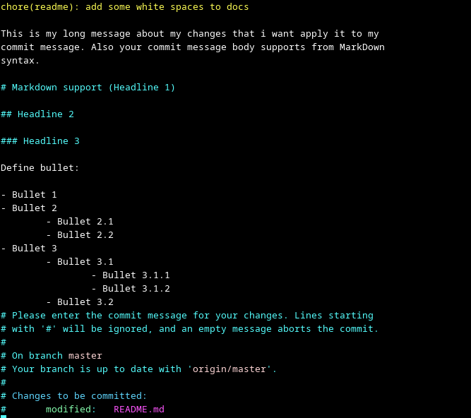

### Command 0: `git init`

`git init` is one way to start a new project with Git. To start a repository, use either `git init` or `git clone` - not both.

### Command 1: `git status`

You can see all your change in your machine before any add (Stage).

### command 2: `git log`

The git log command displays all of the commits in a repository’s history.

### Command 3: `git clone`

You can clone any public repo at any server in your local machine.

### Command 4: `git add .`

After change your code you can add your code to "I have some changes over my
code, so please put them over the stage and add them as new changes!"

__Note__: You can use `git add file_name.extension` to select one or even
multiple files.

### Command 5: `git commit`

Commit can help you to add title and content as message of your change.

#### One line commit message

```bash
git commit -m "one line commit"
```

#### After following it will open your editor to write long message

```bash
git commit
```



### Command 6: `git push`

Send your code to your favorite server.

### Command 7: `git pull`

Download all remote changes over your local machine

__Note__: in some cases, you will need to do `git fetch --all`. This command
will fetch and sync all changes from all branches in your local machine.

### Command 8: `git merge`

Merge one branch to another branch. In following commands, merge master branch
with beta.

```bash
git checkout master
git merge beta
```

### Command 9: `git checkout a new branch`

```bash
git checkout -b new-branch-name
```

### Command 9-1: `git checkout branch-wip`

Switch between branches.

### Command 10: `git switch -c #commit_hash`

You can switch between your repo commit.

### Command 11: `git push --delete origin branch-name`

You can remove a branch from your remote server.

### Command 12: `git checkout -d branch-name`

Remove a branch from your local machine.

### Command 13: `git diff`

You can check all different between now and before.

### command 14: `git reset`

It allows you to undo changes, unstage files, or even discard commits. There are different options for git reset, such as --soft, --mixed, and --hard, each affecting the behavior of the reset operation.

### command 15: `git blame`

 It shows the author, date, and commit hash for each line, giving you insights into who made the changes and when.